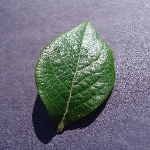
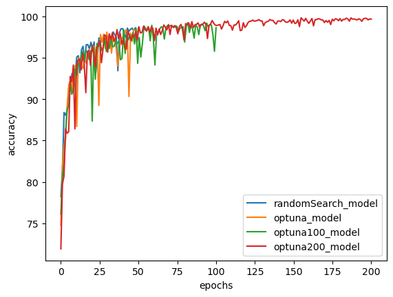
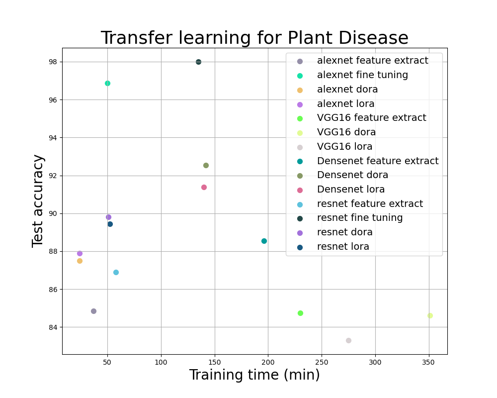

**Table of Contents**
  * [Background](https://github.com/LeeBenyamin/Sherleaf-Holmes-project/tree/main#background)
  * [plant village dataset](https://github.com/LeeBenyamin/Sherleaf-Holmes-project/blob/main/README.md#plant-village-dataset)
  * [Files in this repository](https://github.com/LeeBenyamin/Sherleaf-Holmes-project/blob/main/README.md#files-in-this-repository)
  * [Prerequisites](https://github.com/LeeBenyamin/Sherleaf-Holmes-project/blob/main/README.md#prerequisites)
  * [How to run](https://github.com/LeeBenyamin/Sherleaf-Holmes-project/blob/main/README.md#how-to-run)
  * [Results](https://github.com/LeeBenyamin/Sherleaf-Holmes-project/blob/main/README.md#results)
  * [References](https://github.com/LeeBenyamin/Sherleaf-Holmes-project/blob/main/README.md#references)

# background

Project goal: Detection of plant species and diseases from images.
We conducted extensive research on various architectures to optimize our results. Initially, we developed a custom CNN network. Initially, we engineered a custom CNN network, achieving high test accuracy with clean data. However, encountering challenges posed by noisy data prompted us to pivot towards pre-trained models. Leveraging transfer learning with established models like VGG, AlexNet, DenseNet, and ResNet, we applied methodologies such as fine-tuning, feature extraction, DoRA, and LoRA. Ultimately, the adoption of the vision transformers architecture emerged as the most effective solution in addressing noise sensitivity. Throughout each phase, we trained the models and assessed their performance across validation and test sets.

# Plant Village dataset
We utilized a dataset comprising 38 classes encompassing both diseased and healthy plants. This dataset was sourced from the following link: [PlantVillage](//https://paperswithcode.com/dataset/plantvillage "PlantVillage").
example image: 

  

# Files in this repository

File Name   | Purpose
------------- | -------------
PlantDiseaseCnn.ipynb  | this file contains our custom CNN architecture, exploring the abilities and try different strategies in order to get the maximum accuracy. Utilizing Optuna and random search for hyperparameter optimization.
TransferLearningPartA.ipynb  | This notebook uses transfer learning to train existing models (AlexNet, VGG, ResNet, DenseNet). Its divided into two parts: Feature Extraction: Modifies only the last FC layer of each model for training. Fine-Tuning: Trains all layers of the model, starting from pretrained weights, focusing on AlexNet.
TransferLearningPartB.ipynb  | In this Python notebook, we applied transfer learning techniques using LoRA and DoRA. Each model underwent training and evaluation at every epoch using the validation set. Finally, we conducted a final assessment on the test set for each technique. You can find the accuracy and loss results of VGG16, AlexNet, ResNet, and DenseNet in this notebook.
PlantDiseaseVit.ipynb | This document outlines the preprocessing steps for our dataset tailored for the ViT architecture, along with the architecture itself. Additionally, it presents the outcomes of applying this architecture to both clean and noisy datasets.
utils/CNN_plot_utils.py | contains useful functions to export results to .csv file and plot results from .csv files
utils/ViT_utils.py | contains useful functions for pre processing input image to VIT architecture (used only for explanations)
utils/project_results.py | This Python file contains functions to generate plots from CSV results. It accepts CSV files containing accuracy and training time data and plots the corresponding graphs.

# Prerequisites
 
| Library  | Version |
| ------------- | ------------- |
| python |  3.8.18 |
| pyTorch | 2.1.2 |
| pandas | 2.0.3|
| torchvision| 0.16.2  |
| numpy | 1.24.3 |
| tqdm  | 4.65.0 |
| matplotlib | 3.7.2 | 
| image (PIL) | 10.0.1 |

# How to run

Running Locally
Press "Download ZIP" under the green button Clone or download or use git to clone the repository using the following command: git clone https://github.com/LeeBenyamin/Sherleaf-Holmes-project.git (in cmd/PowerShell in Windows or in the Terminal in Linux/Mac)

Open the folder in Jupyter Notebook (it is recommended to use Anaconda).

# Results

**our cnn results:**

In the following graph, you can observe the test accuracy achieved using Optuna and Random Search.
 

**transfer learning results:**

In this slide, we present the results obtained from our experiments, showcasing both graphical and tabular representations. The graph illustrates the relationship between accuracy test scores and training time for each model. Notably, the fine-tuned versions of AlexNet and ResNet demonstrate the highest accuracy among all models.

 

**vison transformers results:**

**tables results:**

| Architecture   | test accuracy 
| ------------- | ------------- |
| Our CNN (Optuna model)| 98.4% 
|ALexNet with feture extract | 84.8% |
|AlexNet with fine tuning | 96.8% |
|ALexNet with DoRA | 87.5% |
|AlexNet with LoRA| 87.9%|
|ResNet with feture extract |86.9% |
|ResNet with fine tuning | 98% |
|ResNet with DoRA | 89.8% |
|ResNet with LoRA|89.4%|
|DenseNet with feture extract |88.5%|
|DenseNet with DoRA |92.5%|
|DenseNet with LoRA|91.3%|
|VGG with feture extract |84.7%
|VGG with DoRA |84.6%
|VGG with LoRA| 83.3%
|ViT feature extract |98.6%|

| VGG   | trained with noise | test accuracy with std noise = 0 | test accuracy with std noise = 0.05 | test accuracy with std noise = 0.07 | test accuracy with std noise = 0.09 
| ------------- | ------------- | ------------- | ------------- | ------------- | ------------- |
| Our CNN |  No | 98.4% | 8.2% | 3.7% | 2.6%
| Our CNN |  yes | 92.23% | 97.4% | 90% | 60.8%
|AlexNet with fine tuning | yes | 96.7% | 97.02% |97.08 % | 96.97%
|ViT | no | 98.6% | 95.12% | 92.4% | 88.17% 

# References

"An Image is Worth 16x16 Words" paper:https://arxiv.org/abs/2010.11929

vision transformer architecture explanation: https://www.youtube.com/watch?v=qU7wO02urYU

LoRA paper: https://arxiv.org/abs/2106.09685

DoRA paper: https://arxiv.org/abs/2402.09353

icons made by https://www.flaticon.com/

